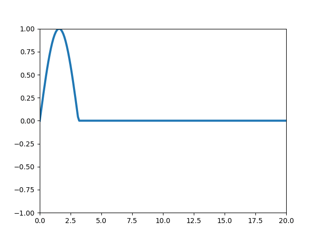

## One-dimensional wave simulation

This python code uses Finite Volume Method to obtain a simulation of a wave propagation. Plot in end of the program shows the motion of a wave in a string with fixed extremities

## finvol-trap-gif.py

This program can create a gif of the wave propagating in a string, as seen below:

For this example, the following conditions are considered:

### Boundary Conditions

$$u(0,t) = 0$$

$$u(L,t) = 0$$

### Initial Conditions

$$u(x,0) = sin(x), 0\le x \le \pi$$

$$u(x,0) = 0, x > \pi$$

$$\left.\frac{\partial u}{\partial t}\right|_{t = 0} = 0$$

Changing boundary and initial conditions, allows to obtain waves with different shapes.
